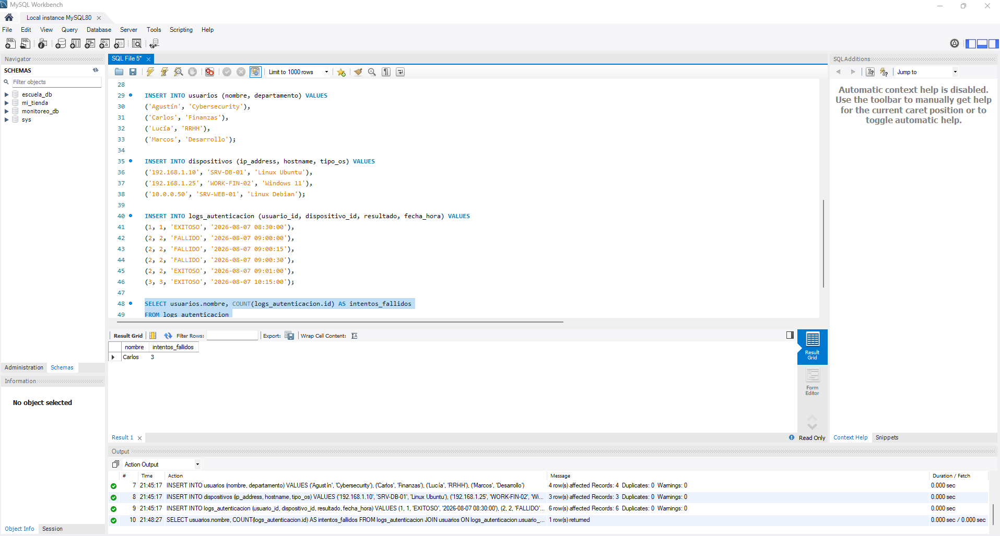
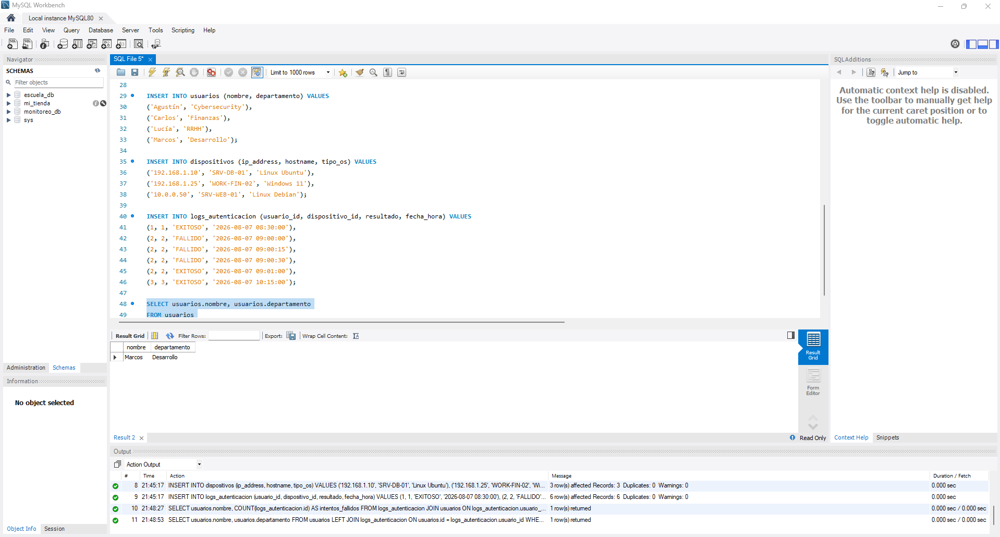
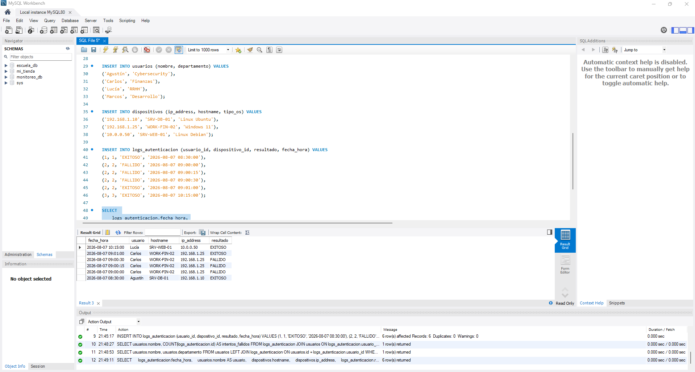

# SOC & SIEM Database - Monitoreo de Autenticación y Auditoría

## Descripción

En este proyecto diseñé e implementé una base de datos relacional en **MySQL** orientada al registro, consulta y análisis de eventos de autenticación.

El laboratorio simula una fuente de información utilizada en un entorno **SOC/SIEM**, donde los eventos de acceso se almacenan y relacionan con los usuarios y dispositivos involucrados.

A partir de estos registros se desarrollaron consultas SQL orientadas a identificar comportamientos relevantes desde el punto de vista de seguridad, como múltiples intentos fallidos de autenticación, cuentas sin actividad registrada y eventos generales de acceso.

---

## Objetivos

- Diseñar una base de datos relacional orientada a eventos de seguridad.
- Relacionar usuarios, dispositivos y eventos de autenticación.
- Aplicar claves primarias y foráneas para mantener la integridad de los datos.
- Utilizar consultas SQL para realizar análisis orientados a seguridad.
- Simular tareas básicas de auditoría que pueden formar parte del trabajo de un analista SOC.

---

## Modelo de datos

La base de datos `soc_monitoreo_db` está compuesta por tres tablas principales:

### 1. `usuarios`

Almacena información de los usuarios registrados en la organización.

Entre los datos registrados se encuentran:

- Nombre del usuario.
- Departamento.
- Estado de la cuenta.

### 2. `dispositivos`

Contiene información sobre los dispositivos desde los cuales se generan los eventos de autenticación.

Incluye datos como:

- Hostname.
- Dirección IP.
- Sistema operativo.

### 3. `logs_autenticacion`

Registra los eventos de autenticación generados por los usuarios.

Cada registro contiene información sobre:

- Usuario involucrado.
- Dispositivo utilizado.
- Fecha y hora del evento.
- Resultado de la autenticación (`EXITOSO` / `FALLIDO`).

La tabla utiliza claves foráneas (`FOREIGN KEY`) para relacionar cada evento con el usuario y dispositivo correspondiente.

---

## Relación entre las tablas

La estructura utilizada permite relacionar los diferentes elementos de la siguiente manera:

```text
usuarios
   |
   | usuario_id
   v
logs_autenticacion
   ^
   | dispositivo_id
   |
dispositivos
```

De esta forma, cada evento de autenticación puede asociarse con el usuario que realizó el intento y con el dispositivo desde el cual se produjo.

---

## Requisitos

Para ejecutar el proyecto se requiere:

- MySQL Server
- MySQL Workbench (opcional)
- Archivo `schema.sql`

---

## Instalación

### 1. Obtener el proyecto

Clonar el repositorio o descargar el archivo `schema.sql`.

### 2. Ejecutar el script

Desde la consola de MySQL puede ejecutarse:

```bash
mysql -u usuario -p < schema.sql
```

También es posible abrir el archivo desde **MySQL Workbench** y ejecutar el script directamente.

El archivo contiene la estructura necesaria para crear las tablas y los datos de prueba utilizados durante el laboratorio.

---

# Análisis de seguridad

## 1. Detección de múltiples intentos fallidos

La primera consulta permite identificar usuarios que acumulan múltiples intentos de autenticación fallidos.

```sql
SELECT 
    usuarios.nombre,
    COUNT(logs_autenticacion.id) AS intentos_fallidos
FROM logs_autenticacion
JOIN usuarios 
    ON logs_autenticacion.usuario_id = usuarios.id
WHERE logs_autenticacion.resultado = 'FALLIDO'
GROUP BY usuarios.nombre
ORDER BY intentos_fallidos DESC;
```

El resultado permite identificar usuarios con una cantidad elevada de intentos fallidos.

Este comportamiento puede utilizarse como indicador inicial de un posible **ataque de fuerza bruta**, aunque por sí solo no confirma que exista un ataque. Para determinarlo sería necesario analizar otros factores, como el intervalo de tiempo, la dirección IP de origen y el dispositivo utilizado.

### Evidencia



---

## 2. Detección de cuentas sin actividad registrada

La siguiente consulta identifica usuarios que existen en la base de datos pero que no poseen ningún evento registrado en `logs_autenticacion`.

```sql
SELECT 
    usuarios.nombre,
    usuarios.departamento
FROM usuarios
LEFT JOIN logs_autenticacion 
    ON usuarios.id = logs_autenticacion.usuario_id
WHERE logs_autenticacion.id IS NULL;
```

Para realizar esta búsqueda se utiliza un `LEFT JOIN`, lo que permite conservar todos los usuarios aunque no tengan registros asociados en la tabla de eventos.

La información obtenida puede utilizarse para detectar cuentas que no presentan actividad registrada y que podrían requerir una revisión administrativa.

### Evidencia



---

## 3. Reporte general de auditoría

La siguiente consulta permite obtener una visión general de los eventos de autenticación, relacionando usuarios, dispositivos, direcciones IP y resultados de los accesos.

```sql
SELECT 
    logs_autenticacion.fecha_hora,
    usuarios.nombre AS usuario,
    dispositivos.hostname,
    dispositivos.ip_address,
    logs_autenticacion.resultado
FROM logs_autenticacion
INNER JOIN usuarios 
    ON logs_autenticacion.usuario_id = usuarios.id
INNER JOIN dispositivos 
    ON logs_autenticacion.dispositivo_id = dispositivos.id
ORDER BY logs_autenticacion.fecha_hora DESC;
```

Este reporte permite reconstruir de forma sencilla qué usuario realizó un intento de autenticación, desde qué dispositivo se produjo y cuál fue el resultado.

Este tipo de información puede utilizarse como base para tareas de **auditoría, investigación y correlación de eventos de seguridad**.

### Evidencia



---

# Conclusiones

Este laboratorio permitió aplicar conceptos de bases de datos relacionales a un escenario relacionado con la seguridad informática.

A través del diseño de la base de datos y de las consultas SQL fue posible:

- Relacionar usuarios, dispositivos y eventos de autenticación.
- Mantener la integridad de los datos mediante claves foráneas.
- Identificar múltiples intentos fallidos de autenticación.
- Detectar usuarios sin actividad registrada.
- Obtener información relacionada con direcciones IP, dispositivos y resultados de autenticación.
- Generar consultas que pueden servir como punto de partida para tareas de análisis dentro de un entorno SOC.

Si bien se trata de un entorno de laboratorio, la estructura representa de forma simplificada el tipo de información que puede ser analizada para detectar comportamientos sospechosos y realizar investigaciones de seguridad.

---

## Tecnologías utilizadas

- MySQL
- MySQL Workbench
- SQL
- Bases de datos relacionales
- Primary Keys
- Foreign Keys
- `INNER JOIN`
- `LEFT JOIN`
- `GROUP BY`
- `ORDER BY`

---

## Estructura del repositorio

```text
SOC-SIEM-Database/
│
├── README.md
├── schema.sql
├── 01_alerta_fuerza_bruta.png
├── 02_cuentas_inactivas.png
└── 03_auditoria_logs_general.png
```

---

## Autor

**Agustín**  
Estudiante de Seguridad Informática

---

Proyecto realizado con fines educativos para practicar el diseño de bases de datos, consultas SQL y análisis de eventos de autenticación desde una perspectiva de seguridad.
